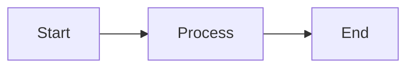

# 🚀 Workshop Content Template

A ready-to-use template for creating professional workshop documentation sites using MkDocs Material and GitHub Pages.

## 📋 Quick Start Guide

### Step 1: Use This Template

1. Click the "Use this template" button on GitHub
2. Create a new repository with your desired name
3. Clone your new repository locally

### Step 2: Enable GitHub Pages

**⚠️ IMPORTANT: This must be done before your first deployment**

1. Go to your repository on GitHub
2. Navigate to **Settings** → **Pages** (in the left sidebar)
3. Under **Source**, select **GitHub Actions**
4. Click **Save**

### Step 3: Configure Your Workshop

1. Update `mkdocs.yml`:
   ```yaml
   site_name: Your Workshop Name
   site_description: Your Workshop Description
   site_author: Your Name
   site_url: https://YOUR-USERNAME.github.io/YOUR-REPO-NAME/
   
   repo_name: YOUR-USERNAME/YOUR-REPO-NAME
   repo_url: https://github.com/YOUR-USERNAME/YOUR-REPO-NAME
   ```

2. Update the repository settings in `.github/workflows/deploy.yml` if needed (usually not required)

### Step 4: Add Your Content

1. Place your workshop markdown files in `docs/Hands-on-Labs/`
2. Add images to `docs/Hands-on-Labs/images/`
3. Update `docs/index.md` with your workshop introduction

Example structure:
```
docs/
├── index.md                     # Workshop homepage
└── Hands-on-Labs/
    ├── index.md                 # Labs overview
    ├── 00-prerequisites.md      # Your first lab
    ├── 01-getting-started.md    # Your second lab
    ├── 02-advanced-topics.md    # Additional labs...
    └── images/
        ├── diagram1.png
        └── screenshot1.png
```

### Step 5: Deploy

Simply push your changes to the `main` branch:
```bash
git add .
git commit -m "Add workshop content"
git push origin main
```

The GitHub Actions workflow will automatically:
1. Build your MkDocs site
2. Deploy it to GitHub Pages
3. Your site will be available at: `https://YOUR-USERNAME.github.io/YOUR-REPO-NAME/`

## 🎨 Features

- **Professional Theme**: Uses the 40docs workshop theme with Material design
- **Automatic Deployment**: GitHub Actions handles building and deployment
- **Rich Content Support**: 
  - Code syntax highlighting
  - Mermaid diagrams
  - Image lightbox (click to zoom)
  - Admonitions (notes, warnings, tips)
  - Tabbed content
  - Tables
- **Dark Mode**: Elegant dark theme by default
- **Mobile Responsive**: Works perfectly on all devices
- **Search**: Built-in search functionality

## 📁 Repository Structure

```
.
├── .github/
│   └── workflows/
│       └── deploy.yml          # GitHub Actions workflow
├── docs/
│   ├── index.md               # Homepage
│   └── Hands-on-Labs/
│       ├── index.md           # Labs landing page
│       └── images/            # Lab images
├── mkdocs.yml                 # MkDocs configuration
├── requirements.txt           # Python dependencies
└── README.md                  # This file
```

## 🛠️ Local Development

To preview your site locally:

1. Create a Python virtual environment:
   ```bash
   python3 -m venv venv
   source venv/bin/activate  # On Windows: venv\Scripts\activate
   ```

2. Install dependencies:
   ```bash
   pip install -r requirements.txt
   ```

3. Clone the theme (required for local preview):
   ```bash
   git clone https://github.com/40docs/theme_workshop_azure.git theme
   ```

4. Run the development server:
   ```bash
   mkdocs serve
   ```

5. Open http://127.0.0.1:8000 in your browser

## 📝 Writing Content

### Markdown Extensions

This template supports advanced markdown features:

**Admonitions:**
```markdown
!!! note "Important Note"
    This is a note with a custom title

!!! warning
    This is a warning message

!!! tip
    This is a helpful tip
```

**Code Blocks with Syntax Highlighting:**
```markdown
```python
def hello_world():
    print("Hello, Workshop!")
```
```

**Tabbed Content:**
```markdown
=== "Tab 1"
    Content for tab 1

=== "Tab 2"
    Content for tab 2
```

**Mermaid Diagrams:**
```markdown

```

### Best Practices

1. **File Naming**: Use numbered prefixes for labs (00-, 01-, 02-) to maintain order
2. **Images**: 
   - Store all images in `docs/Hands-on-Labs/images/`
   - Use descriptive names
   - Optimize images for web (compress large files)
3. **Navigation**: MkDocs automatically generates navigation from your file structure
4. **Headings**: Use proper heading hierarchy (# for title, ## for sections, etc.)

## 🚨 Troubleshooting

### Deployment Fails with 404 Error

**Problem**: "Failed to create deployment (status: 404)"

**Solution**: Enable GitHub Pages in repository settings (see Step 2 above)

### Site Not Updating

**Problem**: Changes pushed but site doesn't update

**Solutions**:
1. Check GitHub Actions tab for build errors
2. Ensure you're pushing to the `main` branch
3. Clear browser cache or try incognito mode
4. Wait 2-3 minutes for deployment to complete

### Local Preview Not Working

**Problem**: Theme not found error

**Solution**: Clone the theme repository:
```bash
git clone https://github.com/40docs/theme_workshop_azure.git theme
```

### Build Warnings

The workflow may show warnings about missing theme files locally - these are normal and don't affect the deployed site.

## 🔧 Advanced Configuration

### Custom Domain

1. Add a `CNAME` file to the `docs/` directory with your domain
2. Configure DNS settings with your domain provider
3. Update `site_url` in `mkdocs.yml`

### Modify Theme

The theme is automatically cloned during build. To customize:
1. Fork the theme repository
2. Update the clone URL in `.github/workflows/deploy.yml`

### Add Plugins

Add MkDocs plugins by:
1. Adding to `requirements.txt`
2. Configuring in `mkdocs.yml` under `plugins:`

## 📚 Resources

- [MkDocs Documentation](https://www.mkdocs.org/)
- [Material for MkDocs](https://squidfunk.github.io/mkdocs-material/)
- [GitHub Pages Documentation](https://docs.github.com/en/pages)
- [Markdown Guide](https://www.markdownguide.org/)

## 📄 License

This template is part of the 40docs organization and is designed for creating workshop documentation.

---

**Need Help?** Open an issue in the repository or check the [GitHub Actions logs](../../actions) for detailed error messages.