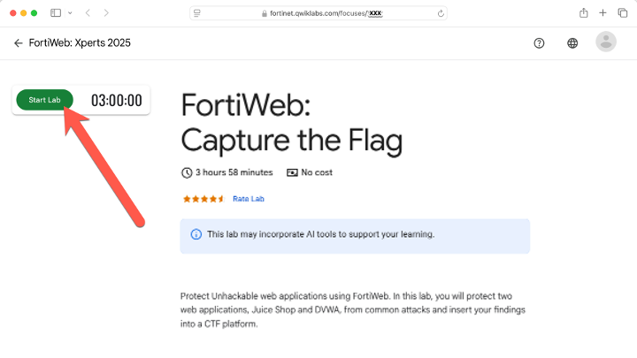

---
mark_as_read:
    updated_at: 2024-03-24 17:00:00+03:00
---

# Lab 1: Lab Access

!!! warning
    Use an Incognito or private browser window to prevents charges to a personal GCP account

1. Use the Qwiklabs link provided by the instructor, and click 

    

    - Time remaining
    - Temporary credentials
    - Project ID
    - Links to additional student resources

1. Open Google Cloud console in new browser tab by clicking the **Google Cloud Console** link in **Student Resources**.

    !!! note
        If the "**Choose an account**" dialog appears, thenb click **Use Another Account**

1. Copy the **GCP Username** and **Password** from the **Lab Details** panel and paste it into the **Sign in** dialog. Click **Next**.

    !!! warning
        Use the credentials from the left panel found in the Qwiklabs console, do not use personal Google Cloud Skills Boost credentials.

1. Click through the subsequent pages:

    * Accept the terms and conditions.
    * Do not add recovery options or two-factor authentication
    * Do not sign up for free trials.
