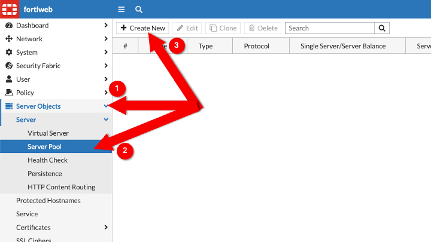

---
mark_as_read:
    updated_at: 2024-03-24 17:00:00+03:00
---

# Lab 2: FortiWeb Setup

This lab configures the required objects on the Fortiweb to serve two vulnerable applications, DVWA and JuiceShop

## Task 1: FortiWeb Login

The Interface IP address of the FortiWeb is used for management on port 8443 and is also the Virtual Server IP address used to access DVWA and JuiceShop

1. Copy the **FortiWeb Public IP** and **FortiWeb Password**

    

1. Navigate to: [https://FortiWeb-IP:8443](https://FortiWeb-IP:8443) (Substitute the IP address from the Google Console) and use **port 8443**

    - Username: **admin**
    - Password: (Retreive password from Qwiklabs)
    - You will need to change the password

    

1. After logging in, the FortiWeb dashboard is presented

    

## Task 2: Virtual Server

A virtual server is an IP address listener which will accept connections and proxy the request to a backend pool member.

The virtual server may be associated with an interface IP, or additional secondary IP addresses may be configured. In this lab the interface IP is used.

=== "UI"

    1. Navigate to: **Server Objects** -> **Server** -> **Virtual Server**, and click 

        

    1. Enter a name for the Virtual Server and click 

        - **Name**: VirtualServer_01

        

    1. Click 

        

    1. Select **Use Interface IP**

        - **Use Interface IP**: Selected
        - **Interface**:  **port1**

        

    1. The Virtual Server is associated with the interface IP

        

=== "CLI"

    1. In the top right of the FortiWeb UI click 

        

    1. The terminal will open

        

    1. Create the vserver and associate it with **interface port1**

        ```bash
        config server-policy vserver
          edit VirtualServer_01
            config vip-list
              edit 1
                set interface port1
                set use-interface-ip enable
              next
            end
          next
        end
        show server-policy vserver VirtualServer_01
        ```

        

## Task 3: JuiceShop Pool

Create a Server Pool with the IP address and port of the JuiceShop server

=== "UI"

    1. Navigate to: **Server Objects** -> **Server** -> **Server Pool** and click 

        

    1. Name the new server pool, and click 

        - **Name**: JuiceShop_Server

        

    1. Click 

        

    1. Enter the following information and click 

        - **IP**: 10.10.3.2
        - **Port**: 3000

        

    1. The new server pool is displayed

        

=== "CLI"

    1. Create the JuiceShop server

        - **IP**: 10.10.3.2
        - **Port**: 3000

        ```bash
        config server-policy server-pool
          edit JuiceShop_Server
            config  pserver-list
              edit 1
                set ip 10.10.3.2
                set port 3000
              next
            end
          next
        end
        show server-policy server-pool JuiceShop_Server
        ```

## Task 4: DVWA Pool

Create a Server Pool with the IP address and port of the JuiceShop server

!!! note
    The DVWA server uses the same IP address as the JuiceShop server, but it uses port 80 instead of 3000

=== "UI"

    1. Navigate to: **Server Objects** -> **Server** -> **Server Pool** and click 

        

    1. Name the new server pool **DVWA_Server** and click 

        

    1. Click 

        

    1. Enter the following information and click 

        - **IP**: 10.10.3.2
        - **Port**: 80

        

    1. The created object appears, click 

        

    1. Navigate to: **Server Objects** -> **Server** -> **Server Pool** to view the DVWA and JuiceShop server pools

        

=== "CLI"

    1. Create the DVWA server

        - **IP**: 10.10.3.2
        - **Port**: 80

        ```bash
        config server-policy server-pool
          edit DVWA_Server
            config  pserver-list
              edit 1
                set ip 10.10.3.2
                set port 80
              next
            end
          next
        end
        show server-policy server-pool DVWA_Server
        ```

## Task 5: JuiceShop Policy

A Server Policy will associate the virtual server IP address with an application pool

=== "UI"

    1. Navigate to: **Policy** -> **Server Policy** and click 

        

    1. Fill in the values and create a new **HTTP Service**

        - **Name**: JuiceShop_server_policy
        - **Virtual Server**: VirtualServer_01
        - **Server Pool**: JuiceShop_Server
        - **HTTP Service**: 

        

    1.  Fill in the values and click  

        - **Name**: HTTP_3000
        - **Protocol**: TCP
        - **Port**: 3000

        
    
    1.  Select the service created and click  

=== "CLI"

    1. Create the JuiceShop policy

        ```bash
        config server-policy service custom
          edit HTTP_3000
            set port 3000
          next
        end
        config server-policy policy
          edit JuiceShop_server_policy
            set ssl enable
            set vserver VirtualServer_01
            set service HTTP_3000
            set replacemsg Predefined
            set server-pool JuiceShop_Server
            config http-content-routing-list
            end
          next
        end
        show server-policy policy JuiceShop_server_policy
        ```

## Task 6: DVWA Policy

A Server Policy will associate the virtual server IP address with an application pool

=== "UI"

    1. Navigate to **Policy** -> **Server Policy** and click 

        

    1. Create an additional **Server Policy** for the DVWA application

        - **Name**: DVWA_server_policy
        - **Virtual Server**: VirtualServer_01
        - **Server Pool**: DVWA_Server
        - **HTTP Service**: HTTP

        

=== "CLI"

    1. Create the DVWA policy. DVWA is associated with the default port 80 service without SSL enabled

        ```bash
        config server-policy policy
          edit DVWA_server_policy
            set vserver VirtualServer_01
            set service HTTP
            set replacemsg Predefined
            set server-pool DVWA_Server
            config http-content-routing-list
            end
          next
        end
        show server-policy policy DVWA_server_policy
        ```

## Task 7: DVWA Reset

1. Copy the **FortiWeb Public IP**

    

1. Use a browser to log into the DVWA application [http://**FortiWeb Public IP**](http://**FortiWeb Public IP**)

    - **Username**: admin
    - **Password**: admin

    

1. Scroll down and click 

    !!! note
        After resetting the database the password will change to **password**

    

1. Wait to be redirected or click **Login**

    - **Username**: admin
    - **Password**: **password**

    

1. Scroll down and click **DVWA Security**, and set it to **Low**

    
