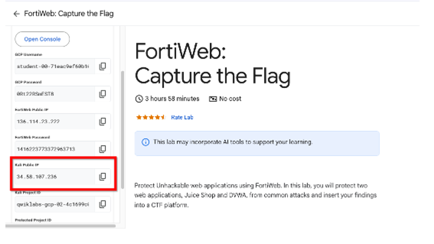
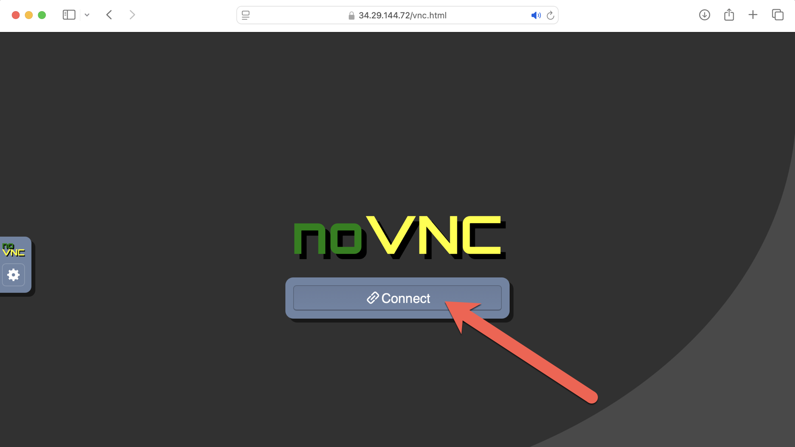
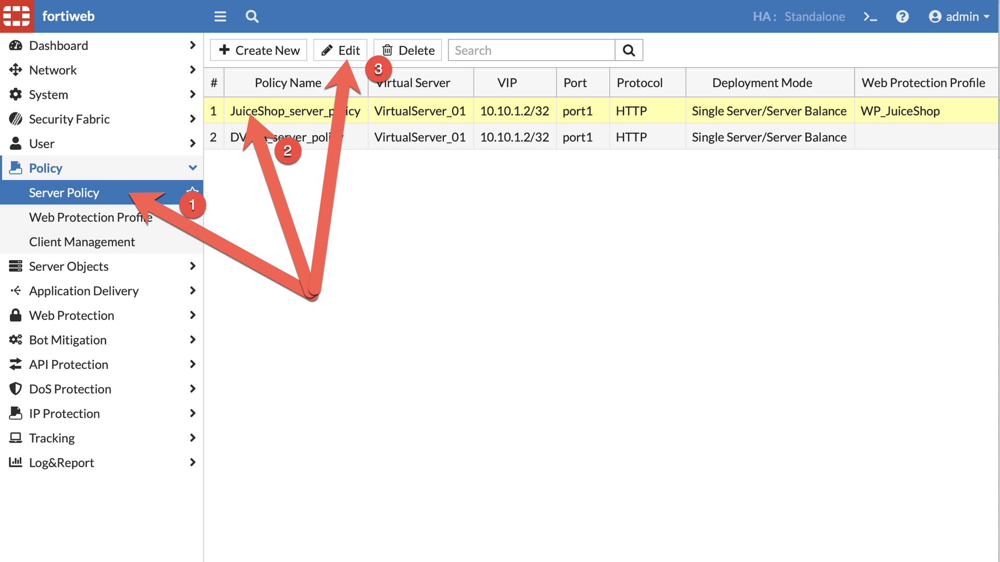

---
mark_as_read:
    updated_at: 2024-03-24 17:00:00+03:00
---

# Lab 3: Bot Protection

Using the Jumpbox launch an automated Bot attack against the JuiceShop, and then create a Bot mitigation policy on the Fortinet to protect JuiceShop

## Task 1: Jumpbox Login

1. Copy the **Kali Public IP** from the Google Qwiklabs console

    !!! note
        Kali Linux is being used in the lab as a Jumpbox

    

1. Browse to: [https://**Kali Public IP**/vnc.html](https://**Kali Public IP**/vnc.html) and click 

    

## Task 2: Unprotected Attack

1. Open the terminal and run the following command

    ```bash
    vim /simple_ff.py
    ```

    

1. Using vim, edit the file `/simple_ff.py`, replace the XXXXX with the FortiWeb Public IP

    !!! tip
        - ```i``` to activate edit mode
        - ```:wq!``` to save and exit
        - ```:q!``` to quit without saving

    

1. Execute the following command in the Jumpbox terminal to launch an attack

    ```bash
    python3 /simple_ff.py
    ```

    

1. Firefox will open and the bot will start running.

    

1. Observe the automation, navigating in the webpage products, creating new user, adding address, payment options, adding items to the basket (shopping cart) and checking out. Wait for all tasks to complete

    

## Task 3: Bot Mitigation

Create a Bot Mitigation profile and associate it with the server policy to block the attack

=== "UI"

    1. Navigate to **Bot Mitigation** -> **Biometrics Based Detection**, and click 

        

    1. Enter the folllowing information and click 

        - **Name**: JS_Biometrics
        - **Monitor Client Events**: Mouse Movements, Screen Touch
        - **Bot Trait Checking**: enabled
        - **Bot Trait Amount**: 2
        - **Event Collection Period**: 10
        - **Report Waiting Time**: 5
        - **Bot Effective Time**: 1
        - **Action**: Alert & Deny
        - **Severity**: High

        

    1. Click 

        

    1. Click 
    
        - **Type**: Regular Expression
        - **Request URL**: .*

        

    1. Navigate to: **Bot Mitigation** -> **Bot Mitigation Policy**, and click 

        

    1. Enter the following details and click 

        - **Name**: JS_BotMitigationPol
        - **Biometrics Based Detection**: JS_Biometrics

        

    1. Navigate to: **Policy** -> **Server Policy** select **JuiceShop_server_policy**, and click 

        

    1. Scroll down and next to ***Web Protection Profile***, expand it and click **Create**

        

    1. Enter the value **WP_JuiceShop**

        

    1. Scroll down to **Bot Mitigation Policy** and select the Bot profile. Click . Select the profile recently created on **Web Protection Profile** and click 

        

    1. Navigate to **Policy** -> **Server Policy** to see the **WP_JuiceShop** policy applied
    
        

=== "CLI"

    1. Create a biometrics waf profile
        
        ```bash
        config waf biometrics-based-detection
          edit "JS_Biometrics"
            set click disable
            set keyboard disable
            set screen-touch enable
            set bot-traits enable
            set bot-traits-num 2
            set event-collection-time 10
            set report-waiting-time 5
            set action alert_deny
            set bot-effective-time 1
            set severity High
            config  url-list
              edit 1
                set type regex-expression
                set url .*
              next
            end
          next
        end
        show waf biometrics-based-detection JS_Biometrics
        ```

    1. Create the bot mitigation policy

        ```bash
        config waf bot-mitigate-policy
          edit JS_BotMitigationPol
            set biometrics-based-detection JS_Biometrics
          next
        end
        show waf bot-mitigate-policy JS_BotMitigationPol
        ```

    1. Create web-protection profile and associate the bot mitigation policy 

        ```bash
        config waf web-protection-profile inline-protection
          edit WP_JuiceShop
            set ip-intelligence enable
            set bot-mitigate-policy JS_BotMitigationPol
          next
        end
        show waf web-protection-profile inline-protection WP_JuiceShop
        ```

    1. Apply the web-protection profile to JuiceShop server policy

        ```bash
        config server-policy policy
          edit JuiceShop_server_policy
            set web-protection-profile WP_JuiceShop
          next
        end
        show server-policy policy JuiceShop_server_policy
        ```

## Task 4: Protected Attack

1. From the Jumpbox terminal and run the following command again

    ```bash
    python3 /simple_ff.py
    ```

1. Firefox will open and perform the same tasks again. However, this time ForitWeb will start blocking the automated requests

    

1. In the Jumpbox terminal, errors are displayed

    

1. In Firefox, refresh (CTRL+R) the page to view the block message

    

    !!! note
        If the error/block message is not displayed, FortiWeb may still be "learning" the attack behavior
