---
mark_as_read:
    updated_at: 2024-03-24 17:00:00+03:00
---

# Lab 4: ML API protection

## Task 1: Server Policy

Associate a machine learning policy to the JuiceShop server policy

=== "UI"

    1. Navigate to **Policy** -> **Server Policy** highlight JuiceShop_server_policy and click 

        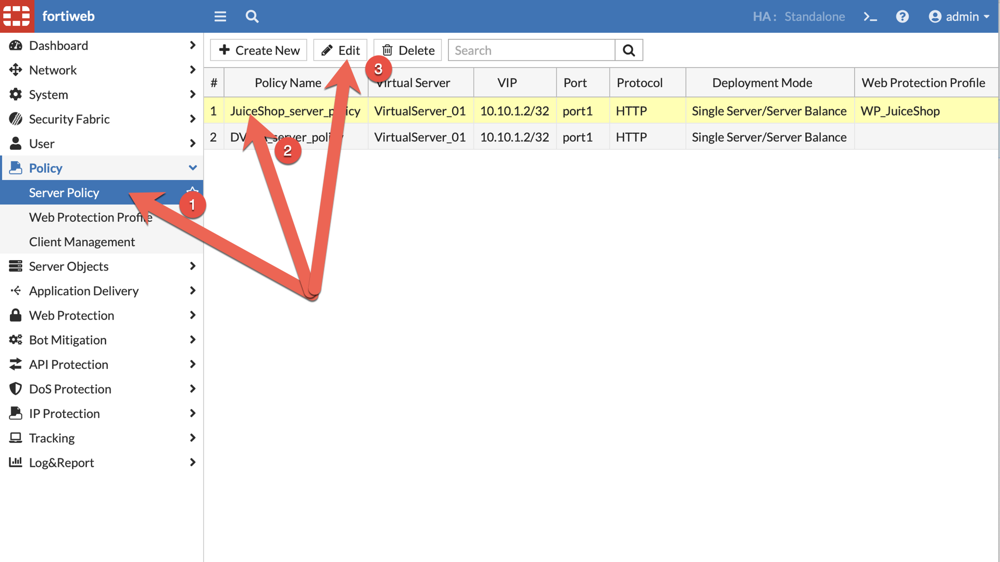

    1. Scroll down and click  **Machine Learning**, select **API Protection** and click **Create**

        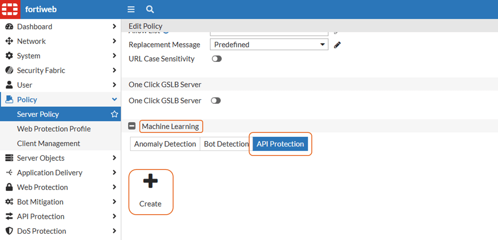

    1. Set the **Domain** and click 

        - **Domain**: *.cloudteamapp.com

        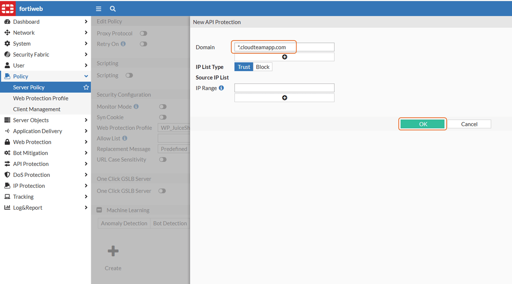

    1. Download [ML Dat](juiceshop_policy.apilearning.dat) file to the local workstation.

        - [juiceshop_policy.apilearning.dat](juiceshop_policy.apilearning.dat)

    1. Select **API Protection**, click **Import**

        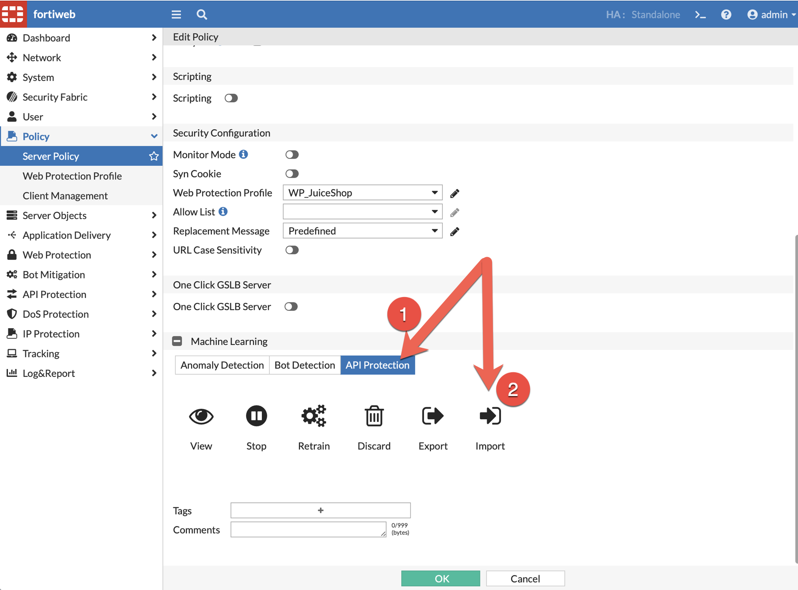

    1. Upload the **ML DAT** file and click 

        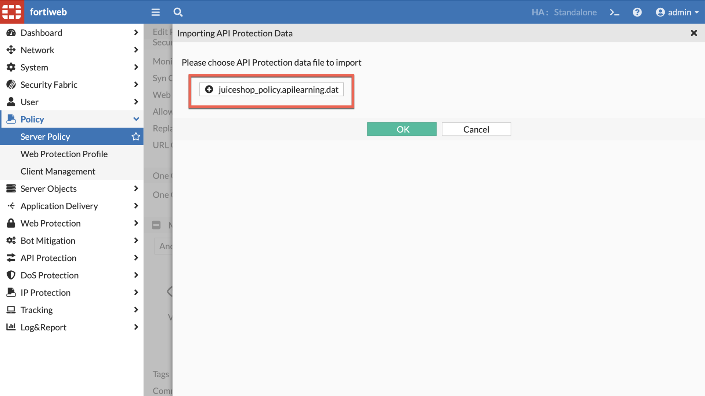

    1. Navigate to: **API Protection** -> **ML Based API Protection**, highlight JuiceShop_server_policy and click 

        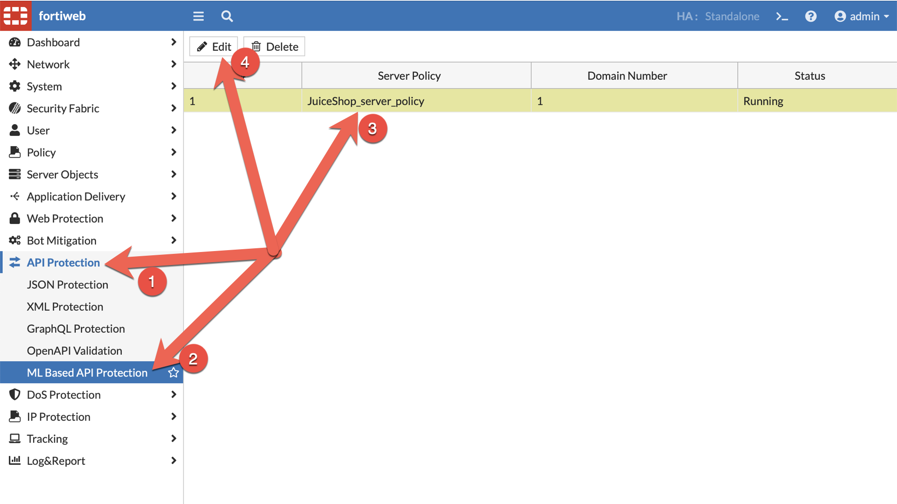

    1. Change the **Schema Protection** from **Standby** to **Alert** and click 

        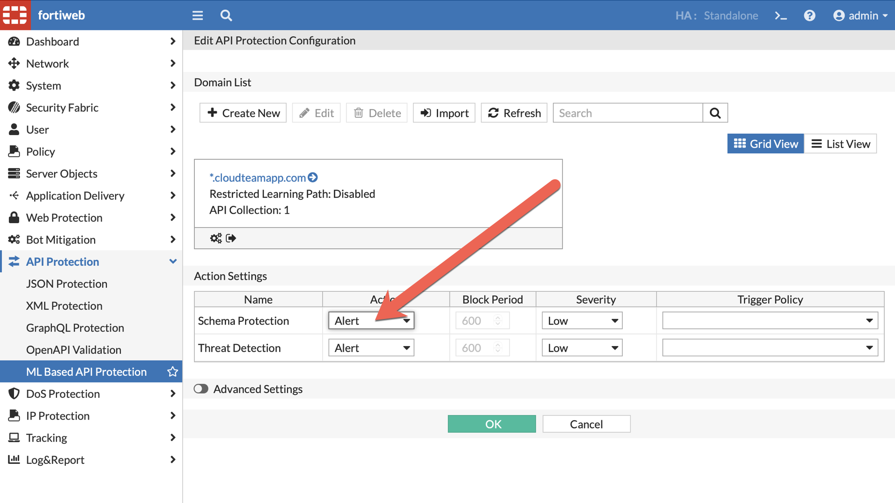

=== "CLI"

    1. Get the policy-id of the JuiceShop policy

        ```bash
        show server-policy policy JuiceShop_server_policy | grep policy-id
        ```

    1. Create a waf api learning rule for "*.cloudteamapp.com"

        ```bash hl_lines="3 13"
        config waf api-learning-policy
          edit 1
            set policy-id <insert-policy-id>
            config api-ip-list
            end
            set start-training-cnt 10
          next
        end
        show waf api-learning-policy

        config waf api-learning-rule
          edit 1
            set policy-id <insert-policy-id>
            set domain-name *.cloudteamapp.com
            config api-path-list
            end
          next
        end
        show waf api-learning-rule
        ```

    1. Download [ML Dat](juiceshop_policy.apilearning.dat) file to your local workstation.

        - [juiceshop_policy.apilearning.dat](juiceshop_policy.apilearning.dat)

    1. Navigate to **Policy** -> **Server Policy** highlight JuiceShop_server_policy and click 

        

    1. Scroll down to **Machine Learning**, select **API Protection** and click **Import**

        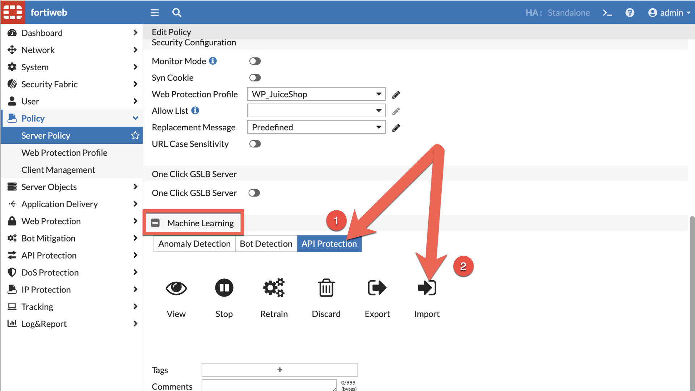

    1. Uplaod the **ML DAT** file and click  twice

        

    1. Change the **Schema Protection** from **Standby** to **Alert**

        ```bash
        config waf api-learning-policy
          edit 1
            set action-mlapi alert
          next
        end
        show waf api-learning-policy
        ```

## Task 2: Jumpbox Login

Log into the Jumpbox, modify the /etc/hosts file and launch an attack

1. Copy the **Kali Public IP** from the Google Qwiklabs console

    !!! note
        Kali Linux is being used in the lab as a Jumpbox

    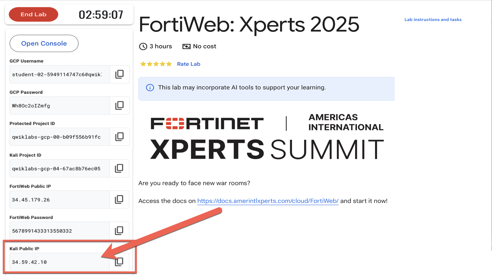

1. Browse to: [https://**Kali Public IP**/vnc.html](https://**Kali Public IP**/vnc.html) and click 

    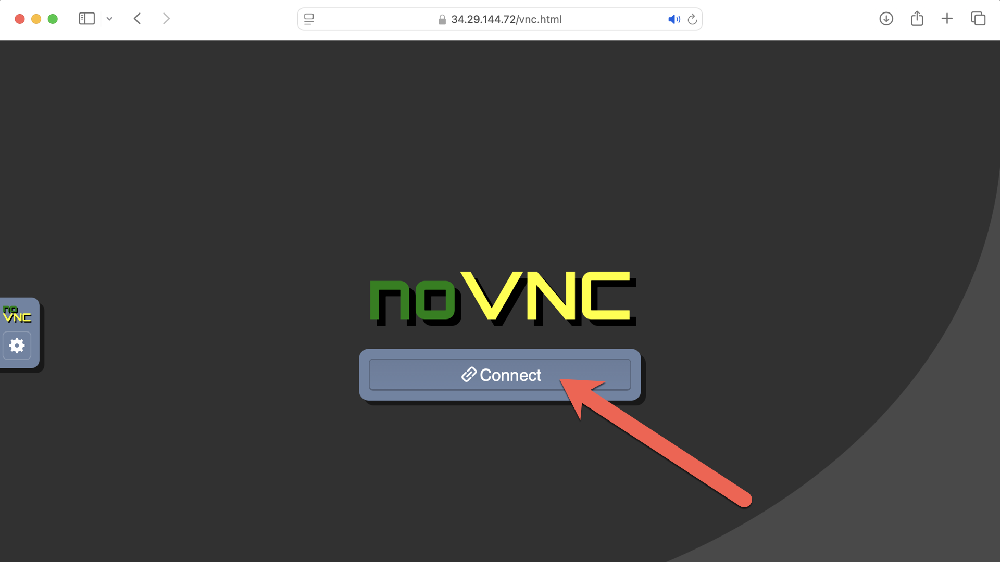

## Task 3: /etc/hosts

1. Copy the Fortiweb Public IP from the Google Console

    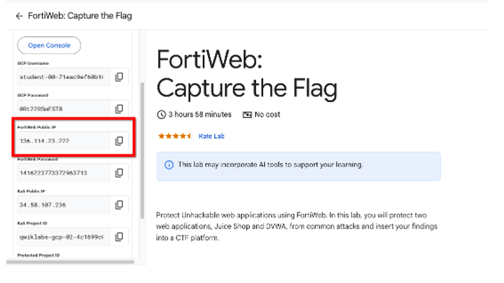

1. In the Jumpbox, Open terminal and type the following command to edit the /etc/hosts file

    ```bash
    vim /etc/hosts
    ```

    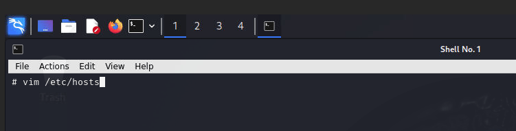

1. Add the following entry to the /etc/hosts file

    - ```<FortiWeb Public IP>``` js.cloudteamapp.com

    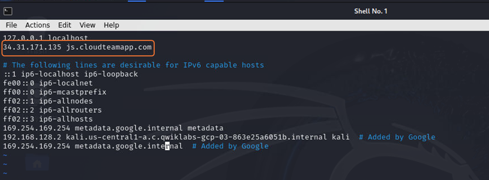

## Task 4: Launch Attack

1. Run the following command in the terminal of the Jumpbox to launch an attack, an anomaly is detected, FortiWeb blocks the attack and an error is displayed

    ```bash
    curl --location --request POST 'http://js.cloudteamapp.com:3000/api/users' --header 'Content-Type: application/json' --data-raw '{"email": "test5@example.com", "password": 123456789}'
    ```

    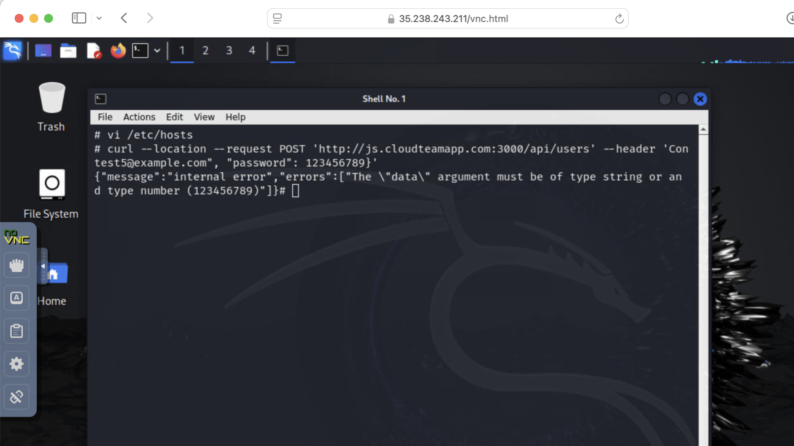


    !!! tip
        Check your CTF :)