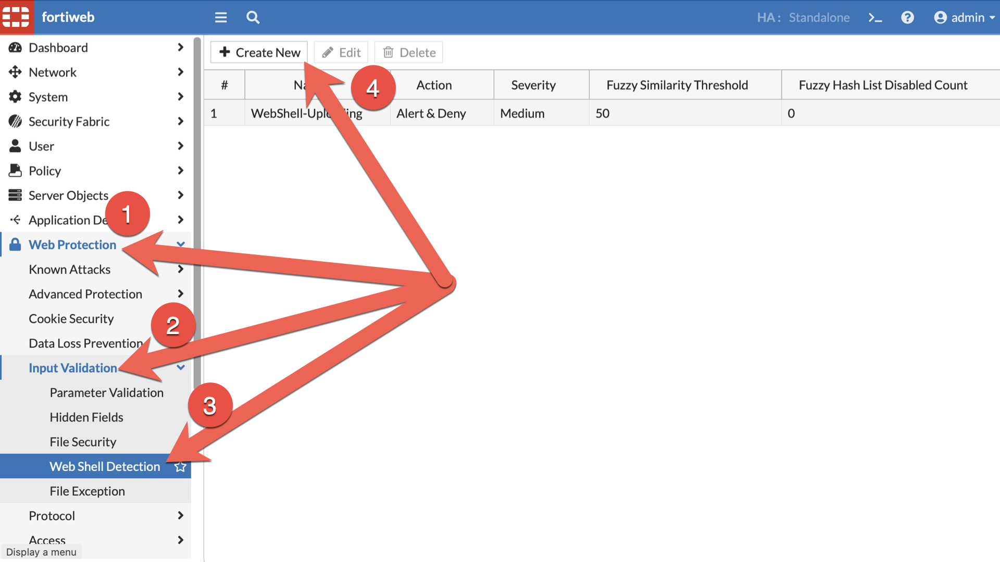
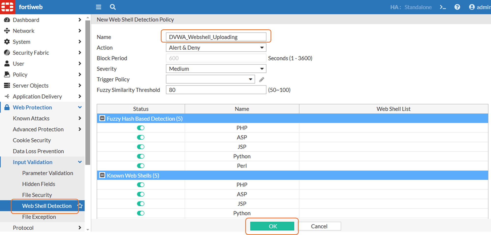
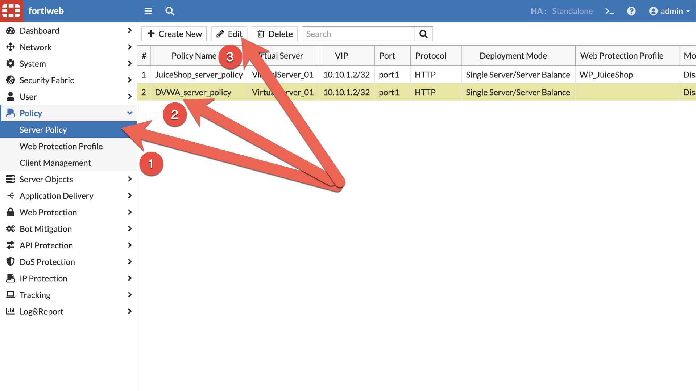
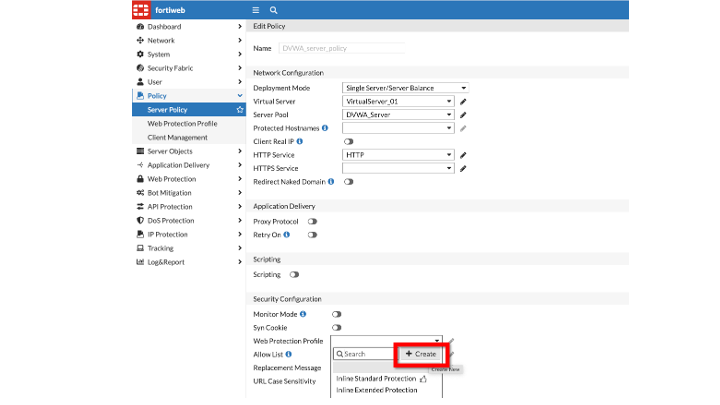
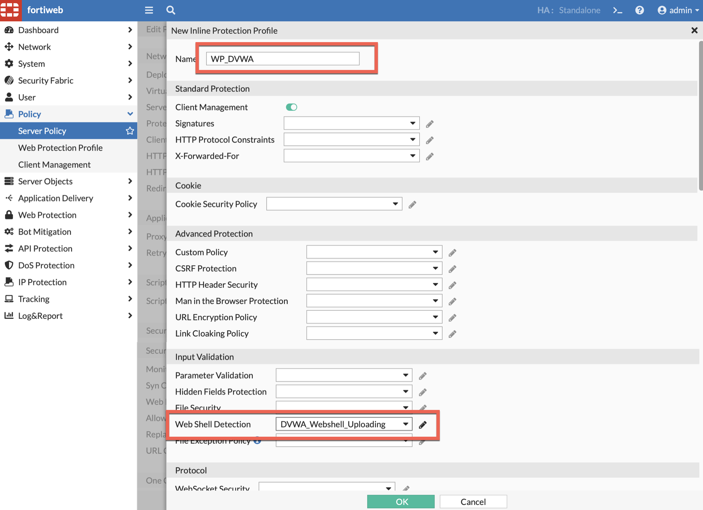
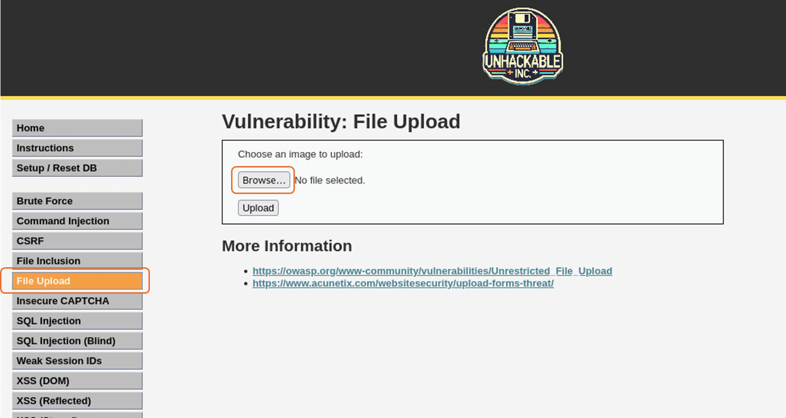
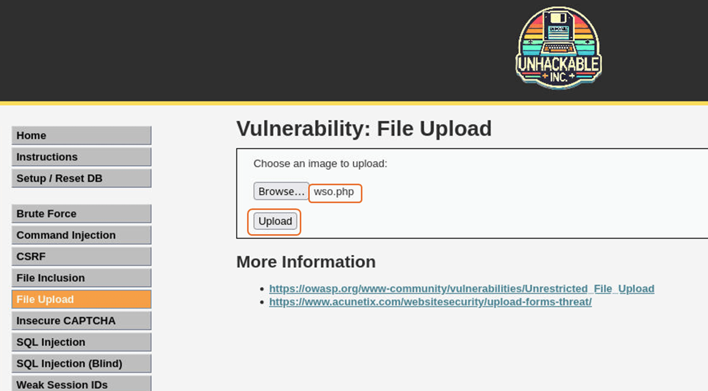
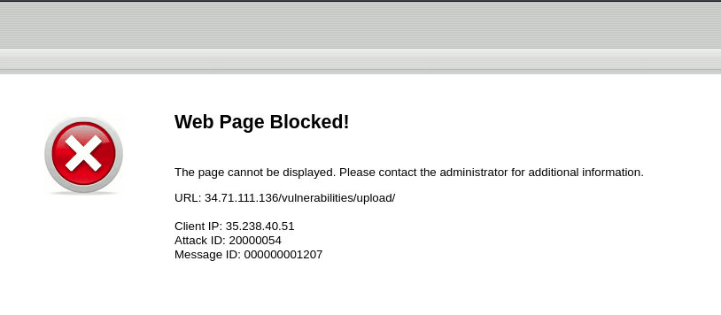

---
mark_as_read:
    updated_at: 2024-03-24 17:00:00+03:00
---

# Lab 5: Web Shell Detection
Attackers may attempt to upload Trojan horse code (written in scripting languages such as PHP and ASP) to the back-end web servers. The Trojan then infects clients who access an infected web page.

!!! tip
    Note: to configure FortiWeb you can use your own browser, but for doing the attacks, maybe your EDR can block them, so you can use the Kali VM (VNC) to perform those tasks.
    
## Task 1: Web Shell Profile

=== "UI"

    1. Navigate to: **Web Protection** -> **Input Validation** -> **Web Shell Detection** and click 

        

    1. Name the new profile **DVWA_Webshell_Uploading** and click 

        

=== "CLI"

    1. Create a new webshell detection policy

         ```bash
         config waf webshell-detection-policy
           edit DVWA_Webshell_Uploading
             config  fuzzy-disable-list
             end
           next
         end
         show waf webshell-detection-policy DVWA_Webshell_Uploading
         ```

## Task 2: Web Protection Profile

=== "UI"

    1. Navigate to: **Policy** -> **Server Policy** select **DVWA_server_policy**, and click 

        

    1. Scroll down and select **Web Protection Profile**, and click **Create**

        

    1. Name the profile **WP_DVWA**, scroll to **Web Shell Detection** and associate **DVWA_Webshell_Uploading**. Click 

        

=== "CLI"

    1. Create a new web protection profile

        ```bash
        config waf web-protection-profile inline-protection
          edit WP_DVWA
            set webshell-detection-policy DVWA_Webshell_Uploading
            set ip-intelligence enable
            set profile-id 9840464857688827830
          next
        end
        show waf web-protection-profile inline-protection WP_DVWA
        ```

    1. Apply the web protection profile to the DVWA server policy

        ```bash
        config server-policy policy
          edit DVWA_server_policy
            set web-protection-profile WP_DVWA
            end
          next
        end
        ```

    1. Select the recently created Web Protection Profile and then click 


## Task 2: Run and check the results

The following steps are completed on a Jumpbox to avoid any anti virus detection software on the local workstation

1. On the Jumpbox, use Firefox to download the [wso.php](https://raw.githubusercontent.com/FortiLatam/juiceshop/refs/heads/main/helpers/wso.php) file

    - [Copy this Link](https://raw.githubusercontent.com/FortiLatam/juiceshop/refs/heads/main/helpers/wso.php)

1. Browse to the DVWA web application, log in and click **File Upload** then **Browse** to upload the wso.php file
    
    !!! tip
        Note: to access DVWA you must use FortiWeb's public IP

    

1. Select the downloaded **wso.php** file and click **Upload**

    

1. FortiWeb blocked the request

    

 !!! tip
        Check your CTF :)