---
mark_as_read:
    updated_at: 2024-03-24 17:00:00+03:00
---

# Lab 6: CSRF Protection

Simulate a password hacking attack, and create a CSRF protection profile to mitigate the application vulnerbility

## Task 1: Unprotected Attack

1. Copy the Fortiweb Public IP from the Google Console

    

1. Browse to the DVWA application [https://**Fortiweb-Public-IP**/login.php](https://Fortiweb-Public-IP/login.php) and login

    - **Username**: admin
    - **Password**: password

    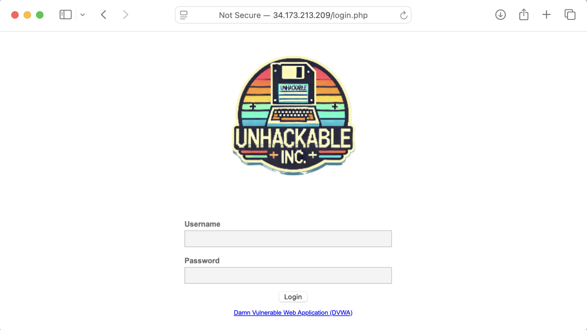

1. Click **CSRF** and change the password

    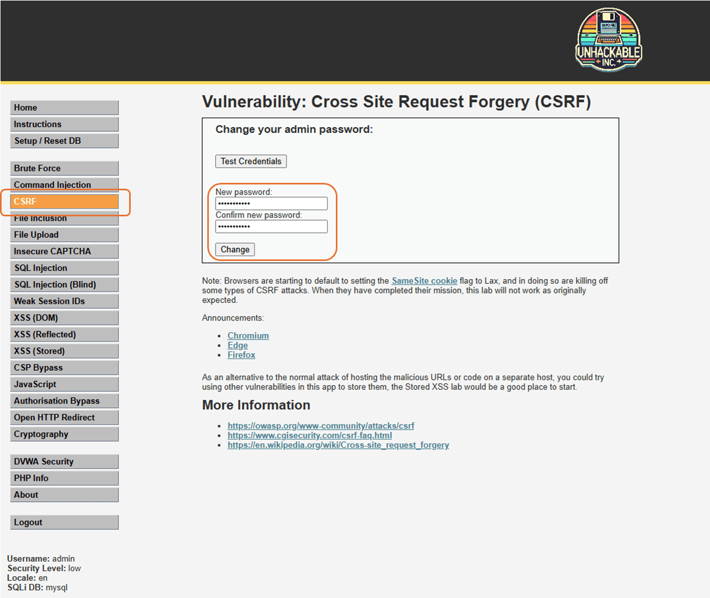

1. Copy the URL

    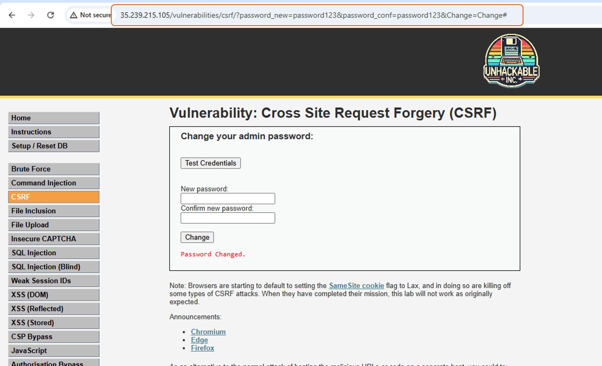

1. Edit the URL to change the password to **hacked**, open a new browser tab and paste the modified URL

    - [http://**FortiWeb Public IP**/vulnerabilities/csrf/?password_new=hacked&password_conf=hacked&Change=Change#](http://FortiWeb Public IP/vulnerabilities/csrf/?password_new=hacked&password_conf=hacked&Change=Change#)

1. Click on Logout and login again using password **hacked**

    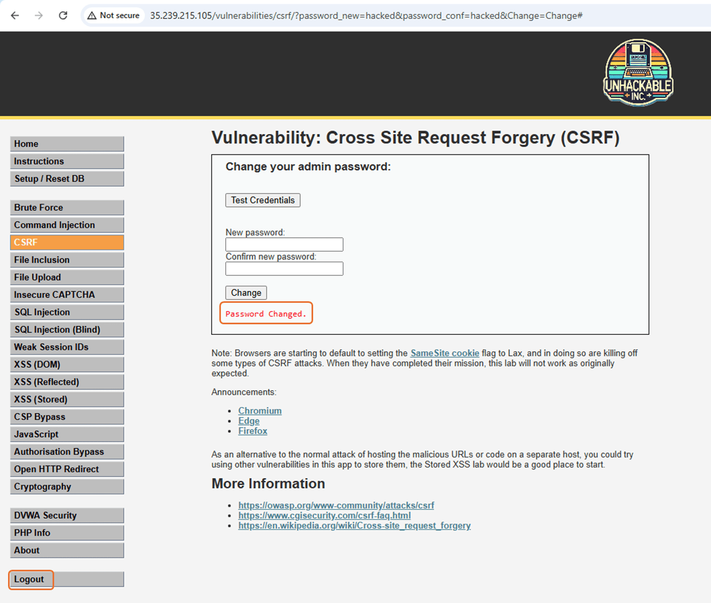

## Task 2: CSRF Profile

1. Navigate to: **Web Protection** -> **Advanced Protection** -> **CSRF Protection** and click 

    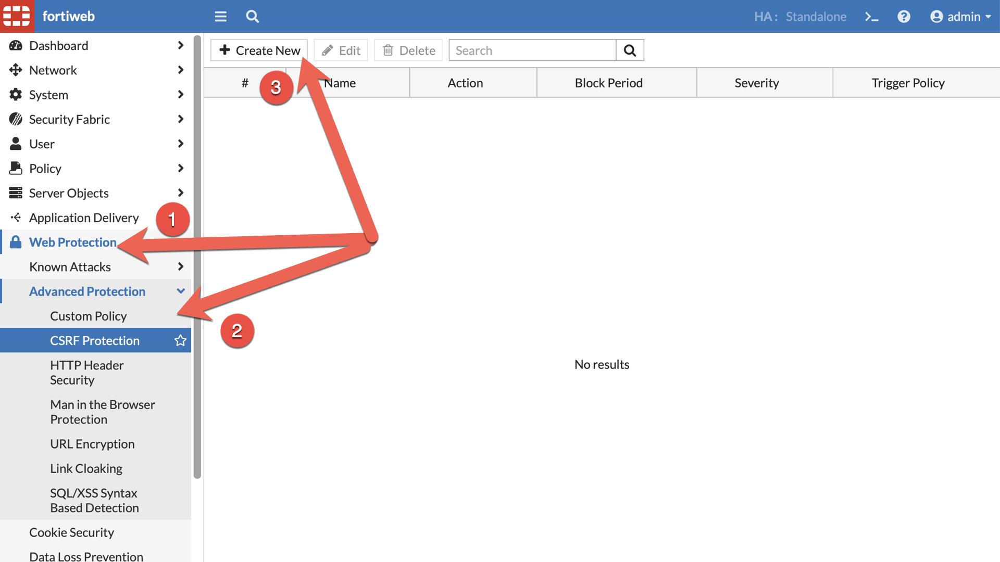

1. Name the CSRF Protection Rule **DVWA_CSRF**, set **Action** to **Alert & Deny**, click , and 

    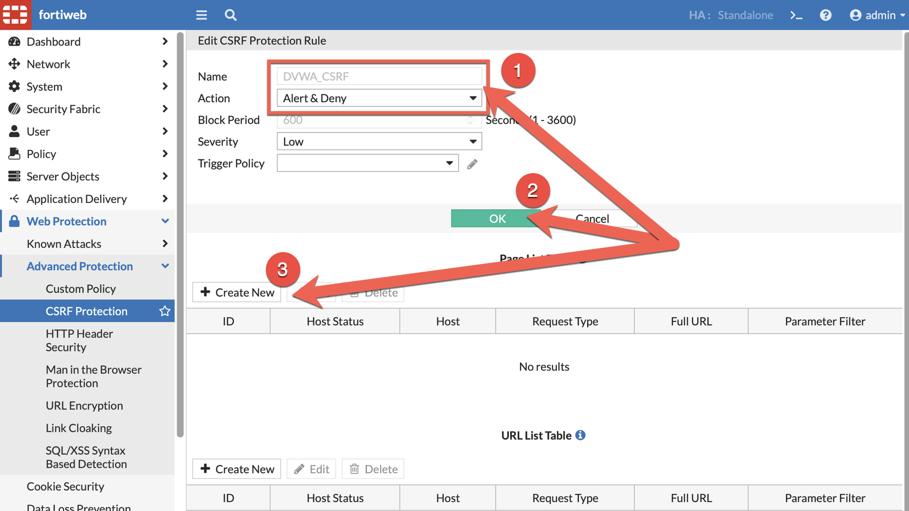

1. Create the 2 new entries following the settings below. Click 

    - /vulnerabilities/csrf/
    - *Only for the URL list entry*:
        - Parameter name: password_new
        - Parameter value: .*

    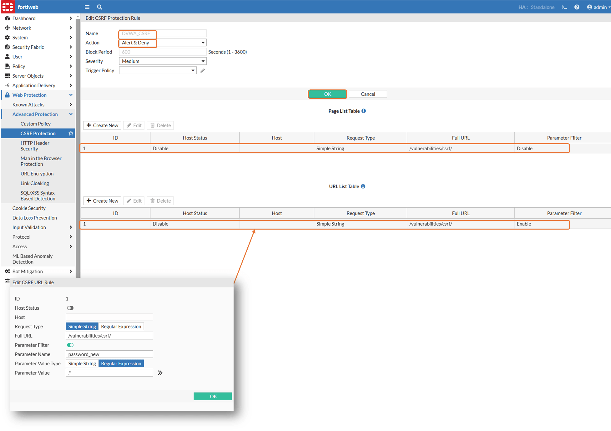

## Task 3: Web Protection Profile

Add the CSRF profile to the **Web Protection Profile**.

1. Navigate to: **Policy** -> **Server Policy**, highlight **DVWA_server_policy** and click 

1. Select **WP_DVWA** and click the 

    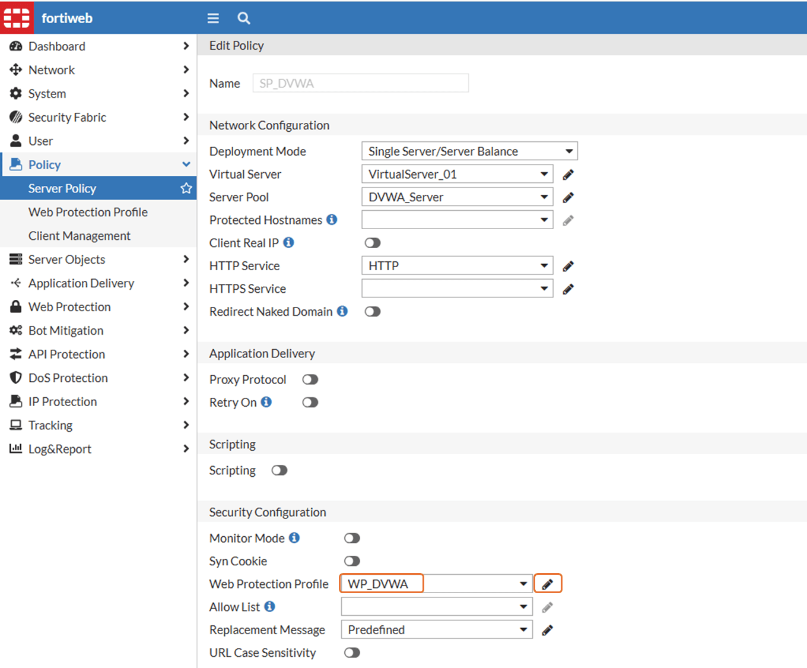

1. Select the CSRF policy created earlier and click 

    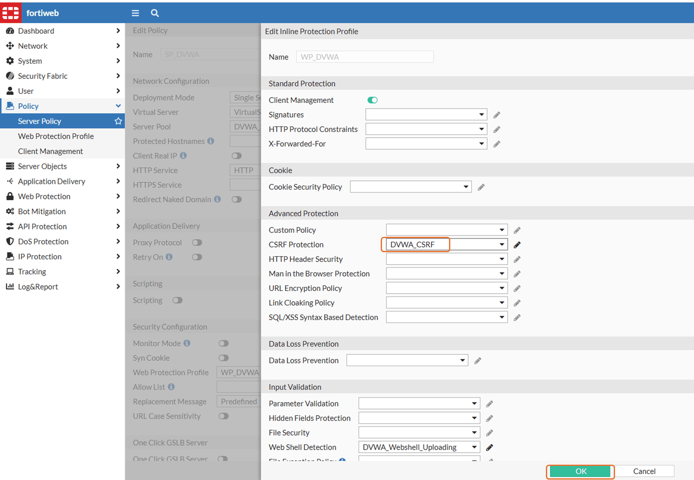

## Task 4: Mitigate the Attack

1. Open DVWA

    - **Username**: admin
    - **Password**: hacked

1. Click **CSRF** in the left menu

1. Change the password

    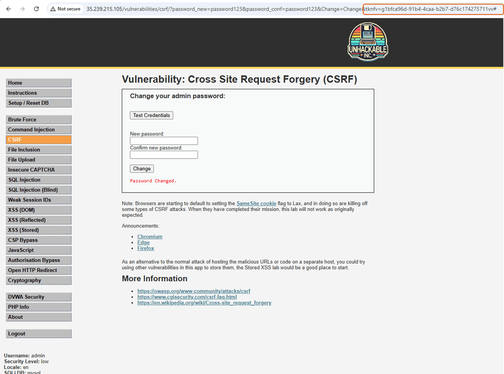

1. A token is generated by FortiWeb. Access the same URL as in Task 1

    - [http://FortiWeb Public IP/vulnerabilities/csrf/?password_new=hacked&password_conf=hacked&Change=Change#](IP/vulnerabilities/csrf/?password_new=hacked&password_conf=hacked&Change=Change#)

1. A block page is displayed

    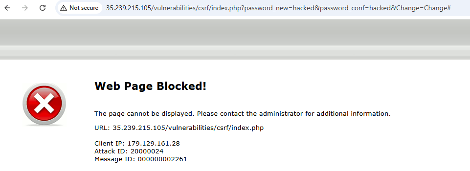

1. Review the logs for more detail

 !!! tip
        Check your CTF :)