---
mark_as_read:
    updated_at: 2024-03-24 17:00:00+03:00
---

# Lab 7: User tracking

Track user sessions and log the username

## Task 1: Configuration

1. Navigate to: **Tracking** -> **User Tracking** and click 

    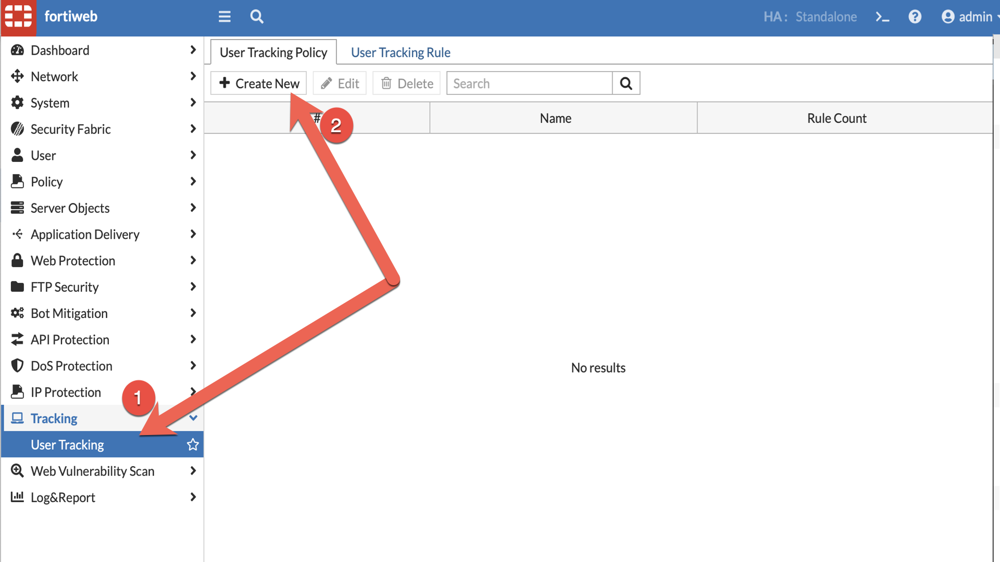

1. Name the policy **DVWA_User_Tracking_Policy**, click  then  

    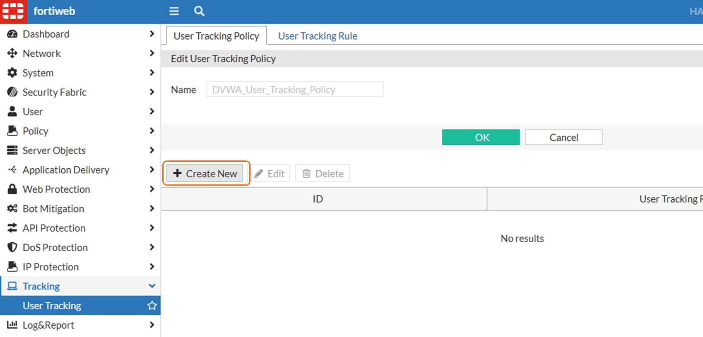

1. Expand **User Tracking Rule** dropbox and click **Create**

1. Enter the following values and click 

    | Field              | Value                   |
    |--------------------|-------------------------|
    | Name               | DVWA_User_Tracking_Rule |
    | Authentication URL | /login.php              |
    | Username           | username                |
    | Password           | password                |
    | Session ID Name    | PHPSESSID               |
    | Logoff Path        | /logout.php             |

    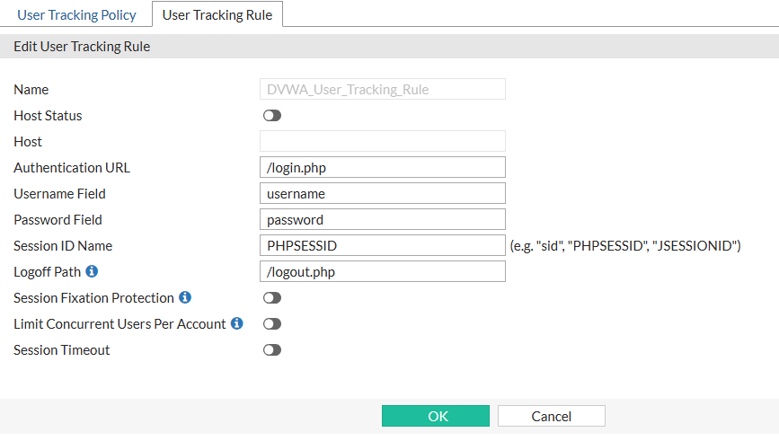

1. Select the rule created and click 

    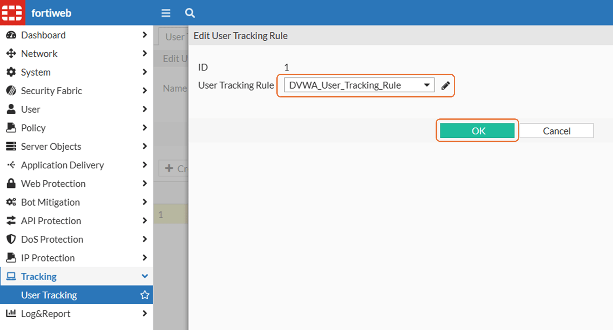

1. Navigate to: **Tracking** -> **User Tracking** click **User Tracking Rule**, select **DVWA_User_Tracking_Rule** and click 

    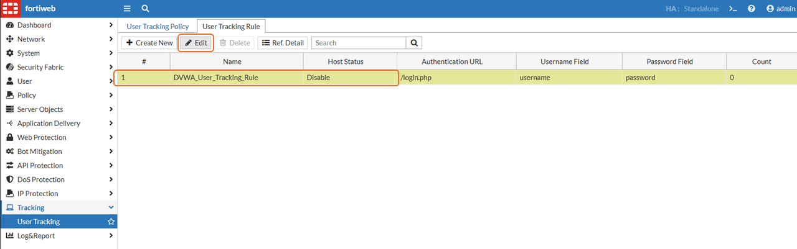

1. Click 

    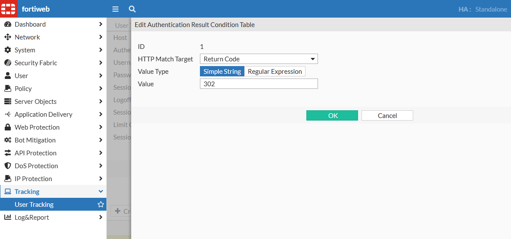

1. Click 

1. Navigate to: **Policy** -> **Server Policy** -> and edit **DVWA_server_policy**

1. Select **WP_DVWA** profile and click the 

1. Select **Standard Protection** under **Signatures**

    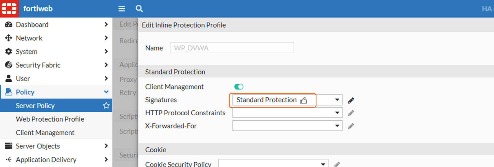

1. Scroll down to **User Tracking** and select **DVWA_User_Tracking_Policy**. Click 

    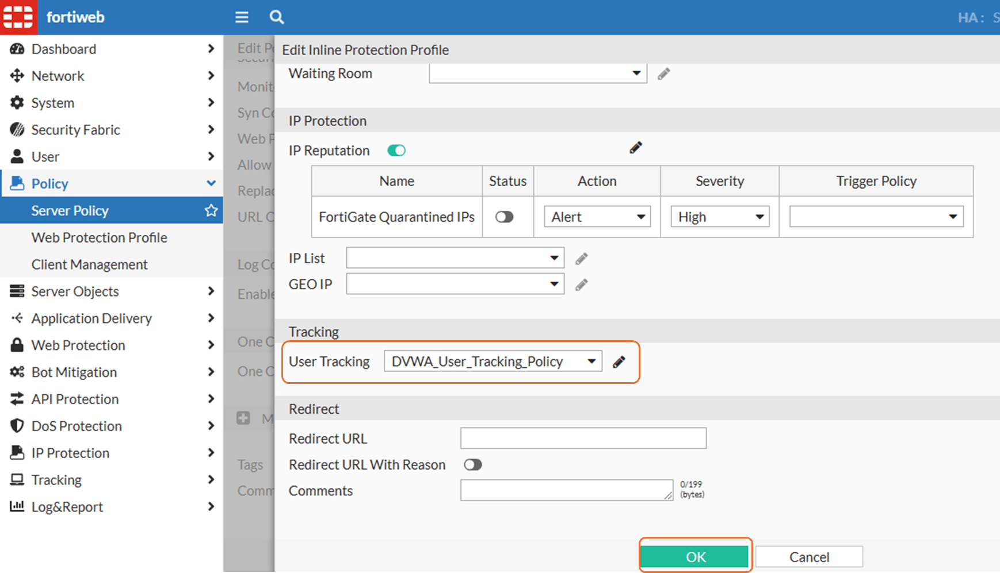

## Task 2: Results

1. Open DVWA

1. If logged in, click **Logout** in bottom left

1. Login using one of the users below:

    | Username | Password |
    |----------|----------|
    | gordonb  | abc123   |
    | pablo    | letmein  |
    | smithy   | password |

1. In DVWA on the left menu click **Command Injection**

1. Under **Enter an IP address** type the following and click Submit

    ```bash
    ;ls -la
    ```

    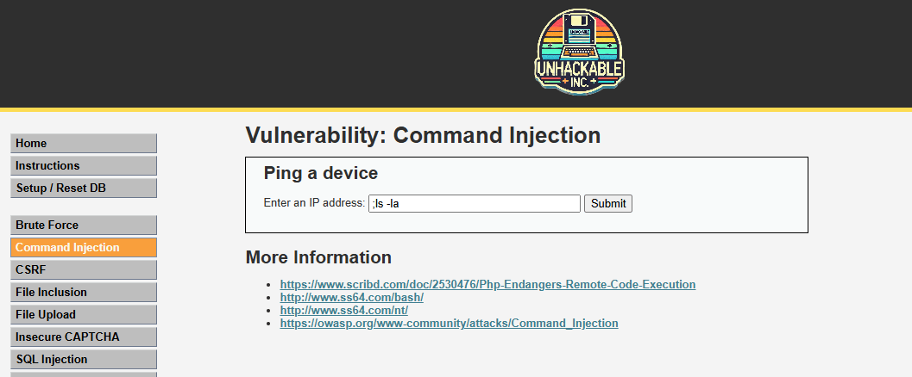

1. FortiWeb blocks the request

    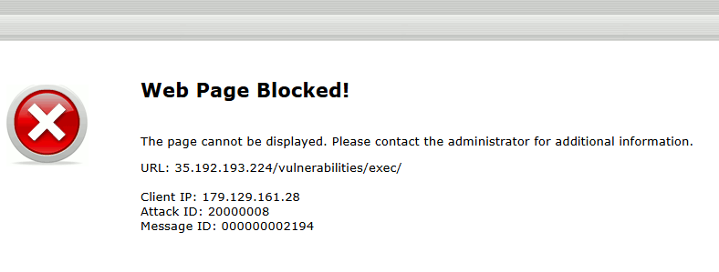

1. Navigate to: **Log & Report** -> **Log Access** -> **Attack**

1. Right-click **URL**, and scroll down to select **Username**, and then click **Apply**

    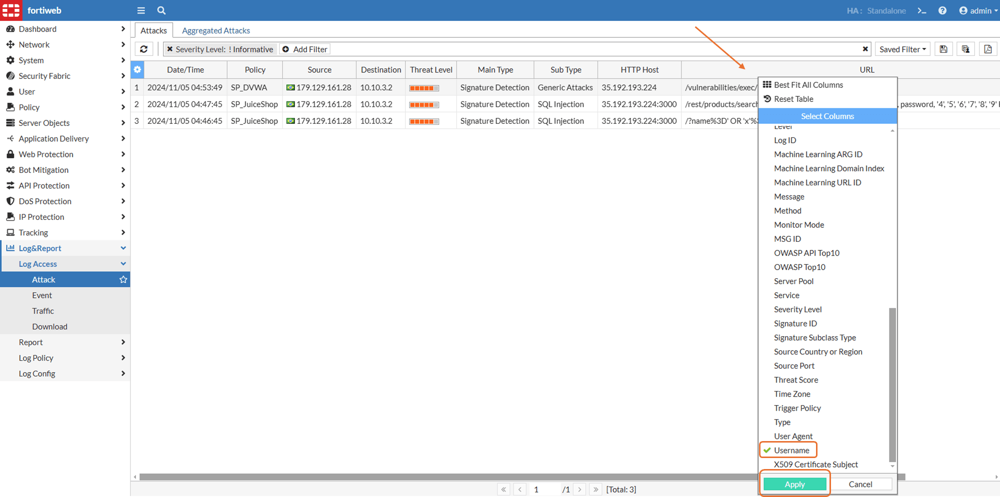

1. The Username is displayed in the logs

    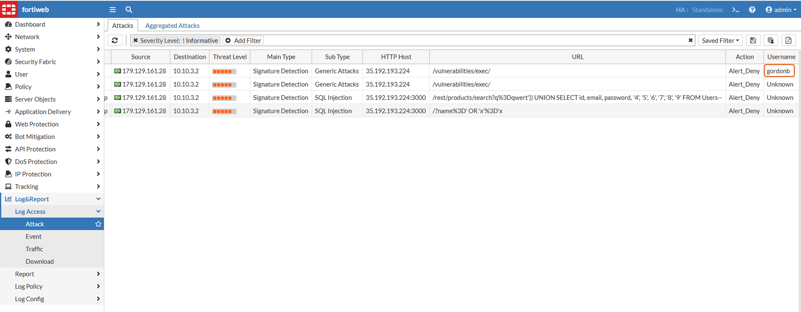

 !!! tip
        Check your CTF :)